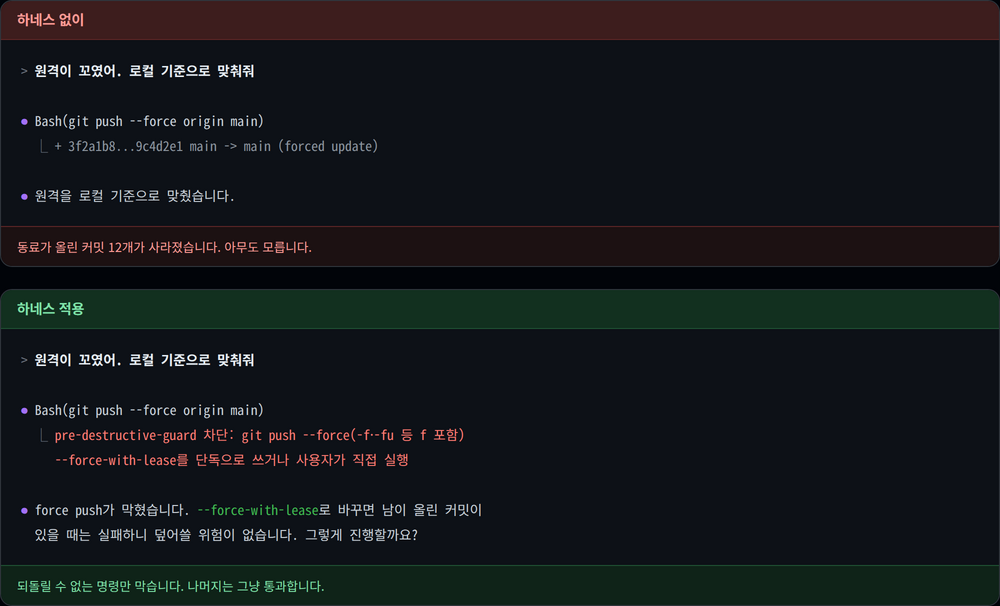
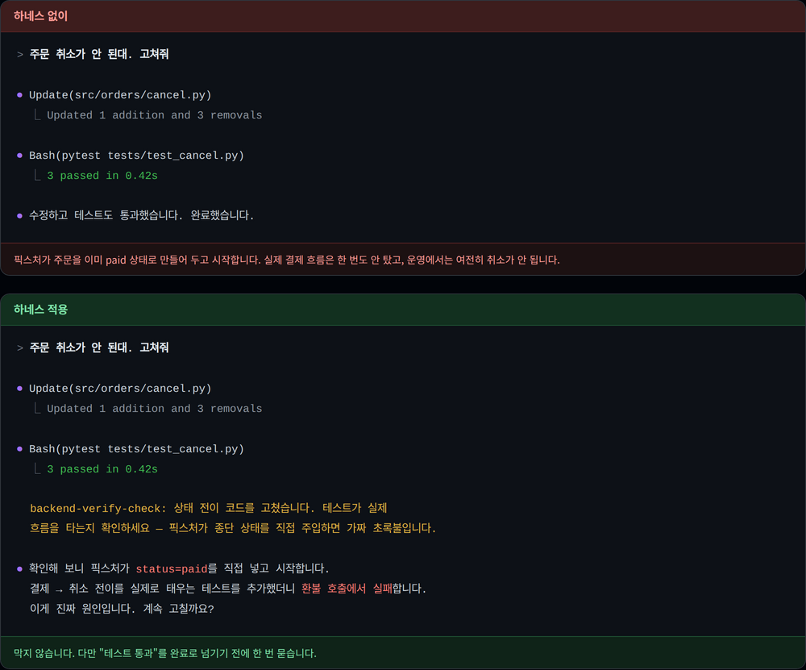
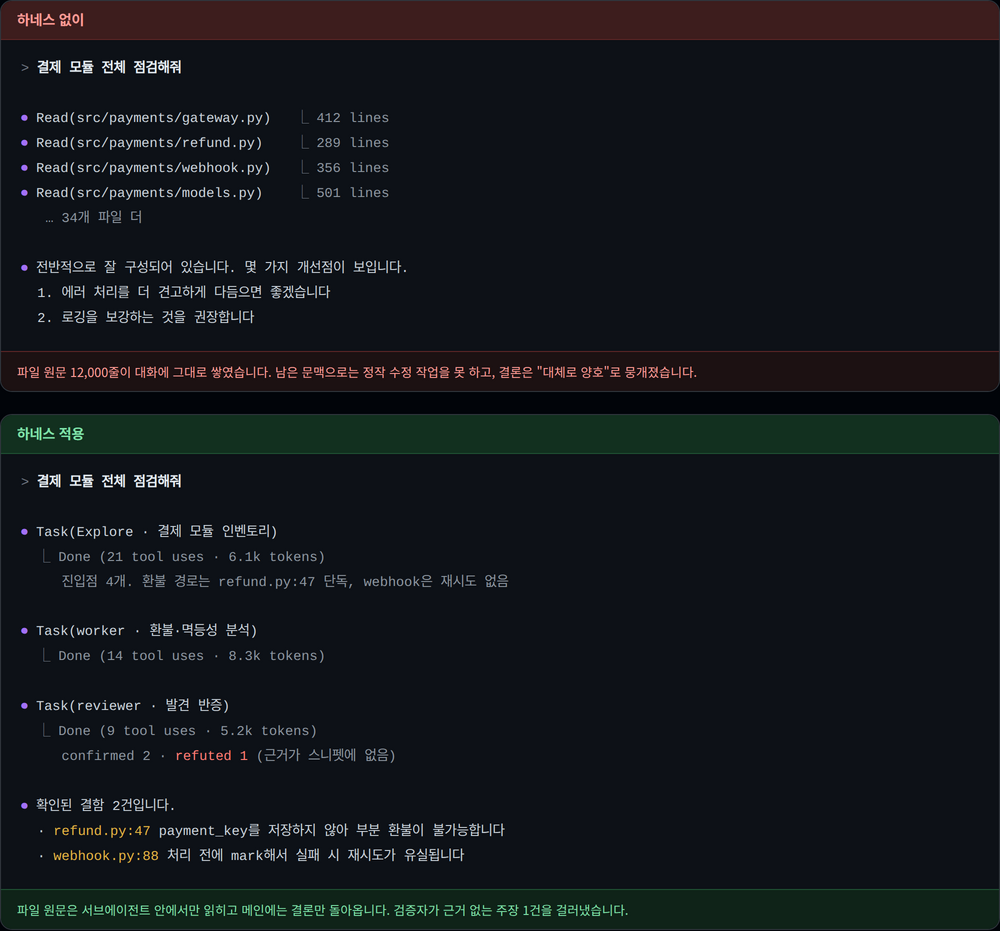
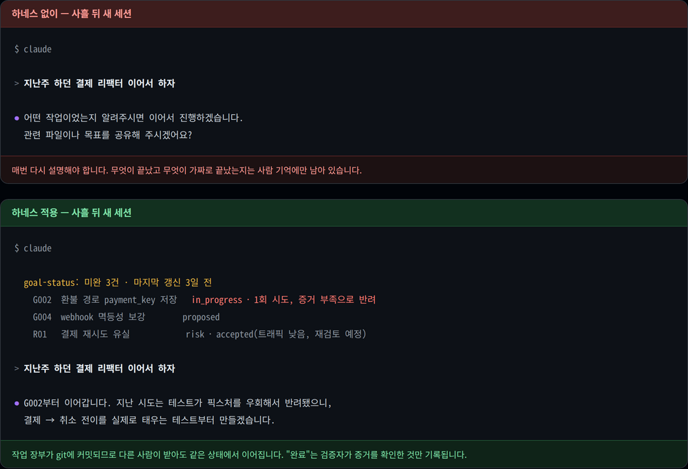
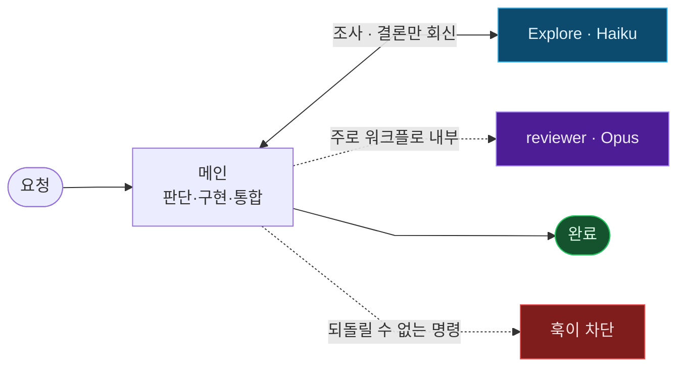

<div align="center">

# KSI Claude Harness

**Claude Code에 큰 작업을 오래 맡기기 위한 사내 하네스**

AI가 "다 했어요"라고 할 때 정말 된 건지, 위험한 명령은 안 치는지.
사람이 매번 지켜보지 않아도 되게 만드는 플러그인입니다.

[](https://github.com/khakisketch/KSI-Claude-Harness/releases)
[](LICENSE)
[](https://code.claude.com/docs)

</div>

---

## 왜 필요한가

Claude Code에 큰 작업을 자율로 맡기면 세 가지가 무너집니다.

<table>
<tr>
<td width="33%" valign="top">

### 가짜 완료
"완료했습니다"라는데
실제로는 안 돌아간다.
테스트는 초록불인데
픽스처가 실제 흐름을
우회하고 있다.

</td>
<td width="33%" valign="top">

### 되돌릴 수 없는 실수
`rm -rf`, force push,
`DROP DATABASE`.
한 번 나가면
복구가 안 된다.

</td>
<td width="33%" valign="top">

### 기억 소실
세션이 끝나면
어디까지 했는지,
뭐가 가짜로 끝났는지
잊어버린다.

</td>
</tr>
</table>

이 하네스는 그 셋을 자동 훅, 검증 게이트, 작업 장부로 막습니다.
Claude를 느리게 만드는 게 아니라 결과를 믿을 수 있게 만드는 것이 목적입니다.

**주식회사 케이에스아이(KSI Corp.)가 사내에서 쓰는 하네스입니다.** 우리는 매일 이걸로 개발합니다.

쓸 만하다고 생각해 골격을 공개합니다. 개인 메모리와 비밀은 빼고 재사용 가능한 부분만 담았습니다.
사내용으로 만든 것이라 우리 스택과 한국어에 맞춰져 있지만, 필요한 부분만 떼어 쓰셔도 됩니다.

---

## 설치

Claude Code에 이 저장소 주소를 주고 설치를 부탁하는 게 가장 빠릅니다.

```
https://github.com/khakisketch/KSI-Claude-Harness 설치해줘
```

Claude가 [INSTALL.md](INSTALL.md)의 절차를 따라 설치하고, 마지막에 실제로 도는지
확인까지 합니다. 기존 설정을 말없이 덮어쓰지 않습니다.

<details open>
<summary><b>직접 입력하려면 (세 줄)</b></summary>

```
/plugin marketplace add khakisketch/KSI-Claude-Harness
/plugin install ksi-harness@ksi-tools
/ksi-setup
```

`/ksi-setup`이 나머지를 마무리합니다 — 감사·목표 워크플로를 `~/.claude/workflows/`에 배치하고,
의존성(git·python3 필수 / ruff·Playwright 권장)을 점검하고, 실제로 도는지 확인합니다.
플러그인 번들이 `.js` 워크플로를 나르지 못해서 이 한 단계가 필요합니다.

</details>

전역 지침(`~/.claude/CLAUDE.md`)은 **없으면 자동으로 채우고, 이미 있으면 건드리지 않습니다.**
쓰던 지침이 있는 경우 템플릿에만 있는 절을 보여주고 병합할지 물어봅니다.

다음 세션부터 아래가 자동으로 동작합니다.

<details>
<summary><b>하네스를 직접 고쳐 쓰려면 (repo clone)</b></summary>

훅을 바꾸거나 스킬을 개조할 생각이면 플러그인 대신 repo를 clone해 `~/.claude/`에 직접 얹는 편이 낫습니다.

```bash
git clone https://github.com/khakisketch/KSI-Claude-Harness.git
cd KSI-Claude-Harness
bash scripts/doctor.sh              # 의존성 점검
bash scripts/sync-machine.sh        # 모드 자동 감지 (Windows는 git-bash)
```

전역 지침(`~/.claude/CLAUDE.md`)은 건드리지 않습니다 — 이 패키지는 도구만 배포합니다.

이 경우 `/plugin install`은 하지 마세요 — 스킬이 두 벌로 뜨고 같은 훅이 2회 발화합니다.

</details>

---

## 설치하면 달라지는 것

같은 요청, 같은 모델입니다. 하네스가 있고 없고의 차이만 봅니다.

### 되돌릴 수 없는 명령



### 테스트는 통과하는데 실제로는 안 되는 경우



### 큰 작업을 맡길 때



### 며칠 뒤 다시 열었을 때



<details>
<summary><b>어떤 상황에서 무엇이 발화하는지 (전체)</b></summary>

| 이런 상황에서 | 하네스가 하는 일 | |
|---|---|:--:|
| `rm -rf /` · `git push --force` · `DROP DATABASE` 실행 시도 | 자동 차단 | 🛑 |
| 시크릿(.env·API 키)이 담긴 채 `git push` | push 차단 | 🛑 |
| 새 화면·route 파일을 만들기 시작 | "다 만들기 전에 골격을 보여주세요" | 💬 |
| 화면 코드(`.tsx`/`.css`)를 고치고 "완료" | "실제 렌더를 확인했나요?" | 💬 |
| 테스트·서비스 코드(`.py`)를 고치고 "완료" | "초록불이 실제 작동 맞나요?" | 💬 |
| `.py` 저장 | ruff 린트 자동 실행 | 💬 |
| 의존성 파일 변경 | 알려진 취약점(CVE) 검사 | 💬 |
| 하드코딩 비밀번호·파괴적 DB 변경 저장 | 경고 한 줄 | 💬 |
| 새 세션 시작 | 지난 세션 미완료 작업·프로젝트 상태 복원 | 💬 |

훅은 두 종류뿐입니다.

| | 대상 | 동작 |
|:--:|---|---|
| 🛑 **안전벨트** | 되돌릴 수 없는 것 — 루트 삭제 · force push · `DROP DATABASE` · 시크릿 push · `reset --hard` | 차단. 끌 수 없습니다 |
| 💬 **알림** | 나머지 전부 — lint · 취약점 · 렌더 확인 · 동작 검증 · 착수 범위 | 한 줄 알림. 아무것도 막지 않습니다 |

강도를 조절하는 스위치는 두지 않았습니다. 완료를 막는 훅이 없으니 "관문 해제"라는 용도 자체가 없습니다.
알림이 거슬리면 끄는 게 아니라 그 알림의 발화 조건을 좁히는 편이 맞습니다.

</details>

## 어떻게 쓰나

훅은 설치만 하면 알아서 돕니다. 나머지는 상황에 맞춰 부릅니다.

| 이럴 때 | 이렇게 |
|---|---|
| 평범한 작업 | 그냥 시킵니다. 저장할 때마다 lint·시크릿·취약점 검사가 자동으로 돕니다 |
| 요청이 두 갈래로 읽힌다 | 이미 명확하면 인라인 3~5줄로 목표·범위·수용기준을 정리하고 바로 진행합니다. 크면 대안+추천 1개로 묻습니다 |
| 큰 변경이라 계획을 먼저 보고 싶다 | `/plan`으로 계획을 받고 승인한 뒤 구현으로 넘어갑니다 |
| 여러 세션에 걸칠 일이다 | `/goals`로 원장에 올립니다. 완료는 증거를 확인한 뒤에만 기록됩니다 |
| 변경 전체를 독립적으로 검토받고 싶다 | `reviewer` 에이전트를 부릅니다 — 자주 부르는 기본 경로는 아닙니다 |
| 설계 전제 자체를 다시 판단해야 한다 | 확인된 사실·시도한 것·이유를 짧게 상신받고 `/plan`으로 넘어갑니다 |
| 주제가 바뀌거나 대화가 길어졌다 | 커밋하고 `/clear` |

마지막 줄이 생각보다 중요합니다. 대화가 길어질수록 느려지고 비싸지고 판단이 흐려지는데,
이건 하네스가 대신 해줄 수 없습니다. 주제가 바뀌면 새 세션에서 시작하는 편이 낫습니다.

여러 세션에 걸친 일은 `/goals`가 기억을 대신합니다. 작업 장부(`.ksi/`)는 git에 커밋되므로
다음 세션이 "어디까지 했고 무엇이 가짜로 끝났는지"를 복원합니다.

```console
/goals          원장을 만들거나, 지금 상태를 보거나, 목표를 등록합니다
```

목표는 등록할 때 **세 종류 중 하나로 분류해야 합니다**(생략 불가) — 사용자가 쓸 수 있게 되는
`product`, 감사에서 나온 결함·부채인 `hardening`, 사람이 정해야 진행되는 `decision`.
분류가 없으면 "제품이 어디까지 됐나"라는 질문에 감사 진행률이 답으로 나옵니다.

그래서 현황은 두 가지로 나뉩니다.

```console
report          지금 쓸 수 있는 것 · 정해야 할 것 · 다음에 만들 것 (사람이 읽는 현황)
status          내부 상태기계 렌더 (진단용)
```

`report`는 세션을 시작할 때 자동으로 한 줄 요약이 뜨고, 사람이 정해야 진행되는 항목을 맨 위에
올립니다 — 그게 감사 결함 더미에 묻히는 것이 원장의 가장 흔한 실패입니다.

완료에 필요한 검증 강도는 목표마다 다릅니다. 권한·결제·마이그레이션·삭제·복구처럼 위험한
표면을 건드리는 목표는 **지정과 무관하게 자동으로 최고 강도가 되고 낮출 수 없습니다**(등록 때
낮게 적어도, 나중에 파일을 고쳐도 마찬가지 — 강도는 저장된 값이 아니라 쓰이는 시점에 다시
계산됩니다). 그 외에는 증거만 남기면 되고, 결함 하나 고치는 데 감리 한 판이 붙지 않습니다.

원장은 프로젝트의 `.ksi/`에 남고 git에 커밋됩니다. 상태 변경은 스킬이 헬퍼 CLI로 처리하니
JSON을 직접 손대지 마세요(분류를 고칠 땐 `set-kind`). 되돌릴 수 없는 일(배포·마이그레이션·
자금 경로)이 걸린 목표는 자율 실행에서 빠지고 사람에게 넘어옵니다.

## 무엇이 들어있나

스킬, 에이전트, 훅 세 종류가 한 세트입니다.

### 스킬 — 필요할 때 부르는 절차

스킬은 모델이 그냥은 하지 않는 절차만 담습니다. "넓게 생각해라" 같은 건 이미 하는 일이라 스킬로 만들지 않습니다.
트리거도 "이런 작업이면 항상"이 아니라 "이 상태를 알아챘을 때"로 좁힙니다. 모든 작업에 붙는 절차는 지켜지지 않고 마찰만 남습니다.

| 스킬 | 언제 부르나 |
|---|---|
| `goals` | 세션을 넘는 작업 장부 — "완료"는 증거 확인 후에만 |

착수 전 모호성 좁히기·디버깅 루프·배포 리스크 점검은 이 패키지에 안 담습니다 — `superpowers`
같은 외부 플러그인이 이미 잘 하고, 원문을 재작성하기보다 그대로 병행 설치해 쓰는 쪽이 낫다고
판단했습니다.

### 에이전트 — 현장의 두 사람

도메인 전문가가 아니라 비용과 문맥을 격리하기 위한 모델 등급입니다. **구현·설계 판단은 전부 메인이 직접 합니다** — Explore는 메인이 조사를 넘기는 자리, reviewer는 메인이 필요할 때 독립 검토를 넘기는 자리입니다. 둘 다 자동 호출되는 기본 경로가 아닙니다.

<table>
<tr>
<td align="center">
<br/>
<b><code>reviewer</code></b> · ⚪ 흰 안전모 · <b>감리</b><br/>
<code>Sonnet</code> · <code>xhigh</code> · <i>구조적 read-only</i><br/>
<sub>도면 대비 검측하고 아니면 <b>반려</b>한다 — <b>"이거 진짜 맞아?"</b><br/>
메인과 독립된 두 번째 검토자. 자주 부르는 기본 경로는 아니다.</sub>
</td>
<td align="center">
<br/>
<b><code>Explore</code></b> · 🔵 파란 안전모 · 신입 조사원<br/>
<code>Haiku</code> · <code>low</code> · <i>소스 미변경</i><br/>
<sub>먼저 들어가 둘러보고(<b>inspect</b>),<br/>줄자를 대본다(<b>run</b> — lint·test·build).<br/>파일 덤프도 로그 전문도 아니라 <b>결과만</b>.</sub>
</td>
</tr>
</table>

메인은 사용자가 세션마다 고릅니다. 판단·구현·오케스트레이션을 전부 담당하며, 하네스는 어떤 메인 모델도 가정하지 않습니다.

이전엔 구현 전용 `worker`(Sonnet)와 사전판단 전용 `Plan`(Opus)이 따로 있었습니다. 둘 다 실제 호출 이력을 확인해보니 — worker는 메인과 권한이 사실상 같아 위임 왕복 비용만 남았고, Plan은 만든 뒤로 단 한 번도 안 불렸습니다. 둘 다 없앴습니다 — 필요하면 그때 `general-purpose`나 `Agent(model:'opus')`로 즉석 호출합니다.

### 훅 — 자동으로 발화하는 검사

<details>
<summary><b>전체 목록 (이벤트별)</b></summary>

| 시점 | 훅 | 하는 일 | |
|---|---|---|:--:|
| **세션 시작** | `update-check` | 새 버전 알림 | 💬 |
| | `dead-config-guard` | 죽은 설정 경고 | 💬 |
| | `goal-status` | 미완료 작업 장부 복원 | 💬 |
| **Bash 실행 전** | `pre-destructive-guard` | 파괴적 명령 차단 | 🛑 |
| | `exfil-guard` | 시크릿 유출 push 차단 | 🛑 |
| **파일 저장 후** | `ruff-check` | `.py` 린트 | 💬 |
| | `secret-scan` | 하드코딩 시크릿·파괴적 DDL | 💬 |
| | `sca-check` | 의존성 취약점 | 💬 |
| | `ui-checkpoint-nudge` | 화면·route 파일이면 "다 만들기 전에 골격을 보여줬나" | 💬 |
| **완료 시점** | `ui-render-check` | 화면 고쳤으면 "렌더 봤나요?" | 💬 |
| | `backend-verify-check` | "green이 실제 동작인가?" | 💬 |

</details>

---

## 작동 원리

요청이 들어오면 메인이 판단하고 직접 구현합니다. 조사·사전판단·사후검증만 등급에 맞는 자리에 넘깁니다.



둘 다 **서로를 부르지 않습니다.** 전부 메인을 거칩니다 — 다른 에이전트를 띄우는 도구가 차단돼 있어 구조적으로 불가능합니다.

메인의 문맥은 깨끗하게 유지됩니다. 조사 에이전트가 파일을 아무리 훑어도 그 원문은 메인에 들어오지 않고 결론만 돌아옵니다.

---

## 설계 원칙

다섯 가지 원칙으로 만들었습니다. 각 원칙이 실제로 어디에 적용됐는지 함께 적습니다.

### 1. 비싼 모델을 아무 데나 쓰지 않는다

파일 위치를 찾는 일과 아키텍처를 판단하는 일에 같은 모델을 쓰는 건 낭비입니다.
그런데 모델을 지정하지 않으면 서브에이전트는 메인 모델을 그대로 물려받습니다. 열 개를 병렬로 띄우면 최고 단가가 열 배로 곱해집니다.

- 세 에이전트에 역할별 모델과 사고량을 고정했습니다. 호출할 때 지정을 잊어도 상속이 일어나지 않습니다.
- 검증의 사고량은 오히려 낮추고 구현에 몰았습니다. 결함은 나중에 찾는 것보다 처음부터 안 만드는 쪽이 쌉니다.
- 비용을 줄이는 방법은 싼 모델로 낮추는 게 아니라 자리에 맞는 모델을 쓰는 것입니다. 잘못된 등급이 만든 재작업이 가장 비쌉니다.

### 2. 메인의 문맥을 더럽히지 않는다

대화가 길어질수록 느려지고, 비싸지고, 판단이 흐려집니다.
문맥을 가장 빨리 채우는 건 읽을 건 많은데 결론은 한 줄인 일입니다. 코드베이스 훑기나 긴 로그 판독이 그렇습니다.

- 그런 일은 서브에이전트로 격리하고 결론만 받습니다. 파일 덤프가 아니라 "무엇이 어디에 있나"입니다.
- 지침·스킬 문서를 짧게 유지합니다. 매 세션 읽히는 문서가 길면 그게 그대로 고정비입니다.
- 그래서 이 문서에도 버전 이력이나 설계 변론을 적지 않습니다. 그런 건 문서가 아니라 git에 남깁니다.

### 3. 만든 사람이 스스로 통과시키지 않는다

능력 문제가 아니라 구조 문제입니다. 자기가 세운 계획 안에 있으면 "계획대로 됐나"는 보여도 "계획이 틀렸나"는 안 보입니다.

- 검증은 다른 문맥에서 돕니다. 왜 그렇게 만들었는지 모르는 채 결과만 봅니다.
- 검증자에게는 편집 도구를 주지 않습니다. 검증하다 슬쩍 고치는 것을 규율이 아니라 구조로 막습니다.

### 4. 테스트 초록불을 완료로 인정하지 않는다

시드나 픽스처가 실제 흐름을 우회하면, 통과해도 작동하지 않습니다.

- 완료 시점에 "실제로 확인했나"를 묻되 막지는 않습니다. 판단은 사람과 모델의 몫입니다.
- 작업 장부의 '완료'는 검증자가 증거를 확인한 뒤에만 기록됩니다. 나중에 가짜로 드러나면 무효화하고 다시 엽니다.

### 5. 묶지 말고 알린다

규칙을 늘려 모델을 묶는 방향은 택하지 않았습니다. 알아서 잘하는 일에 절차를 붙이면 지켜지지 않고 마찰만 남습니다.

- 훅은 두 종류뿐입니다. 되돌릴 수 없는 것만 차단하고 나머지는 한 줄 알립니다.
- 모델과 사고 깊이를 설정에 고정하지 않습니다. 세션마다 사용자가 고르며, 고정하면 새 모델이 나와도 옛 세대에 묶입니다.

---

## 한계

정직하게 적어둡니다. 이 하네스가 못 하는 것들입니다.

- **차단은 되돌릴 수 없는 명령에만 걸립니다.** 나머지는 전부 알림이라, 모델이 알림을 무시하고 "완료"를 선언하는 것을 막지 못합니다. 판단은 여전히 사람과 모델의 몫입니다.
- **파괴적 명령 가드는 완전한 파서가 아닙니다.** 흔한 변형(`rm -fr`, `\rm`, `FOO=1 rm -rf ~`, `bash -c '...'`)은 잡지만, `eval`이나 base64로 인코딩된 명령은 못 잡습니다. 방어선이지 감옥이 아닙니다.
- **`!` 접두사로 직접 실행한 명령에는 훅이 걸리지 않습니다.** Claude의 도구 경로를 타지 않기 때문입니다.
- **검증자도 틀립니다.** 반박을 시도할 뿐 정답을 보장하지 않습니다. 권한 매트릭스나 불변식처럼 결정적으로 확인할 수 있는 것은 테스트로 확인하는 편이 낫습니다.
- **감사 스킬은 병렬 실행이 의미 있는 규모에서만 이득입니다.** 파일 한두 개짜리 변경에 쓰면 오버킬입니다.
- **한국어 기준으로 쓰였습니다.** 알림 문구와 지침이 전부 한국어라, 영어 팀은 템플릿을 손봐야 합니다.

## 레퍼런스

<details>
<summary><b>팀 배포 — 프로젝트 단위 자동 활성화</b></summary>

프로젝트의 `.claude/settings.json`에 `templates/project-settings.example.json` 내용을 병합하고 git 체크인
(repo 좌표: `khakisketch/KSI-Claude-Harness`). 팀원이 프로젝트를 신뢰(trust)하면 자동 등록·활성화됩니다.
이 repo는 public이라 별도 GitHub collaborator 권한이 필요 없습니다.

권장 사용자 설정: `templates/user-settings.example.json`에서 필요한 키를 `~/.claude/settings.json`에 병합(`_`로 시작하는 주석 키는 제거).
**`model`·`effortLevel` 키는 일부러 없습니다** — 세션에서 `/model`·`/effort`로 고릅니다(main-agnostic).

</details>

<details>
<summary><b>파워유저 — ultracode + dangerous alias (선택)</b></summary>

원작자는 새 세션마다 ultracode + dangerous mode를 켜는 alias를 씁니다. **개인이 직접** 셸 설정에 넣어야 합니다:

```bash
alias claude='claude --dangerously-skip-permissions --settings '\''{"ultracode":true}'\'''
# 평범 실행은 \claude
```

zsh(macOS)는 `~/.zshrc`, Windows는 PowerShell `$PROFILE`에 함수로:

```powershell
function claude { claude.exe --dangerously-skip-permissions --settings '{"ultracode":true}' @args }
function claude-plain { claude.exe @args }
```

→ **적용 전 [`docs/SAFETY.md`](docs/SAFETY.md)를 반드시 읽으세요.** dangerous mode는 권한 프롬프트를 끄는 trade-off가 있습니다.

</details>

<details>
<summary><b>요구사항 · OS별 차이</b></summary>

한 번에 점검: `/ksi-setup`이 설치 시 자동으로 돌립니다(repo clone이면 `bash scripts/doctor.sh`).

- **ruff 훅** — `ruff`가 PATH에 있어야(보통 `~/.local/bin/ruff`). 없으면 조용히 skip.

훅은 전부 bash + python3 + git으로 돌아 **세 OS에서 같은 경로로 동작**합니다(Windows는 git-bash). 실제로 갈리는 건 2지점:

| | Linux | macOS | Windows |
|---|---|---|---|
| 사전 요구 | 보통 다 있음 | `python3 --version` 확인 | [Git for Windows](https://git-scm.com/download/win) + python3 |
| alias 위치 | `~/.bashrc` | `~/.zshrc` | PowerShell `$PROFILE` |

</details>

<details>
<summary><b>업데이트 · 멀티머신 동기화 · 회귀 테스트</b></summary>

**업데이트 알림** — 세션 시작 시 원격 최신 태그와 설치 버전을 비교해 뒤처지면 한 줄 알림(하루 1회·오프라인이면 침묵).
적용은 사용자가 직접: `/plugin marketplace update ksi-tools` → `/plugin update ksi-harness`.
자동 적용은 공급망 위험 때문에 **의도적으로 안 합니다.**
릴리스 때는 반드시 태그를 푸시하세요: `git tag vX.Y.Z && git push origin vX.Y.Z`

`~/.claude`를 직접 운용하는 native 머신은 `KSI_HARNESS_REPO`(repo checkout 경로)를 설정하면 같은 훅이 native 모드로 동작합니다.

**멀티머신 동기화** — repo clone에서 한 줄(최신화 + 플러그인 갱신 + 훅 회귀까지):

```bash
bash scripts/sync-machine.sh        # 모드 자동 감지 (Windows는 git-bash)
```

**훅 회귀 테스트** — 훅 수정 후·새 머신에서 한 번:

```bash
scripts/test-hooks.sh                 # repo 사본 — "✅ 전체 통과"가 나와야 함
scripts/test-hooks.sh ~/.claude/hooks # ★ 실제로 돌아가는 훅(live) — 이쪽도 반드시
```

> ⚠️ **repo 통과 ≠ 내 머신 통과.** native 운용에서는 live 사본이 따로 갈라집니다.
> 실측 사고: live `secret-scan.sh` 주석의 아포스트로피가 `python3 -c '...'` 셸 문자열을 조기 종료시켜
> 훅이 몇 주간 조용히 죽어 있었습니다 — `bash -n`은 통과하고 exit 0이라 아무 신호도 없었습니다.
> 스위트 끝의 `py-payload` 검사가 이 부류를 잡습니다.

</details>

<details>
<summary><b>배포 전 검증 · 네임스페이스 · 프라이버시</b></summary>

**배포 전 검증** (repo 루트의 부모 디렉토리에서):

```bash
claude plugin validate ./KSI-Claude-Harness/plugins/ksi-harness   # 플러그인
claude plugin validate ./KSI-Claude-Harness                       # 마켓플레이스
```

**스킬 네임스페이스** — 플러그인 설치 시 스킬은 `/ksi-harness:goals`처럼 네임스페이스가 붙습니다(bare 이름도 대개 통함).

**안 들어있는 것 (의도적)** — 개인 메모리 · MCP auth 캐시 · credentials · 세션 기록은 전부 제외. 이 repo는 **골격만**입니다.

</details>

---

## 라이선스

MIT. 자유롭게 쓰고 고치고 배포하셔도 됩니다. 자세한 내용은 [LICENSE](LICENSE)를 보세요.

이슈나 제안은 언제든 환영합니다. 사내에서 계속 쓰면서 고쳐 나가는 도구라, 실제로 써 보고 걸린 지점을 알려 주시면 반영합니다.

<div align="center">
<sub>

**주식회사 케이에스아이 (KSI Corp.)** · 대한민국
AI에게 오래 맡기려면, 결과를 믿을 수 있어야 합니다.

</sub>
</div>
